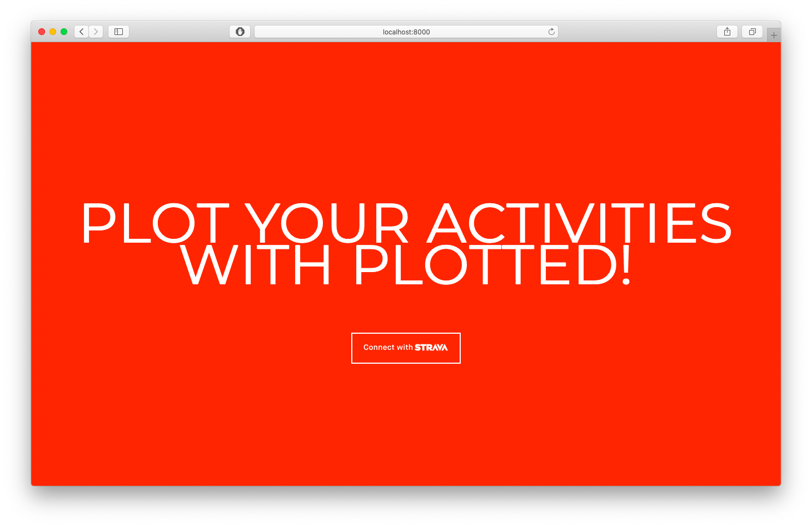
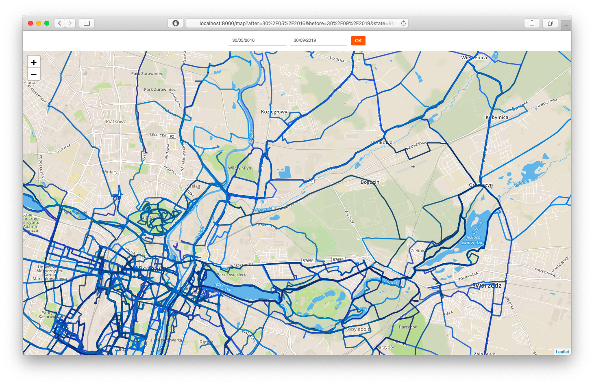

# plotted
Plots your Strava activities on a map.



## Why?
I wanted to have a tool that will plot all my routes from given period on a single map. It's just fun to watch it. Also it gives me information what is still to explore! 

## Prerequisities
1. Account on https://www.strava.com account with trainings to plot, and application created on the https://www.strava.com/settings/api.
2. Account on https://www.mapbox.com
3. Access tokens from abovementioned websites.
4. At least Go 1.11 installed

## Getting started
1. Clone this repository outside your GOPATH, and `cd` into it.
2. Build application
```
go build
```
3. Check supported options with
```
./plotted --help
```
4. Run with some parameters
```
./plotted \
  -start=01/06/2018 \
  -end=30/06/2018 \
  -extended \
  -strava=YOUR_STRAVA_ACCESS_TOKEN \
  -mapbox=YOUR_MAPBOX_TOKEN
```

## TODO

1. Give a warning when within a given time range there was at least one training which started 50 km further from the first training in the range
2. Ask for training summary pages asynchronously. Strava API indicates last page returning empty result, thus algortihm should send package of requests (i.e. 10), and wait some time (i.e. 1 second). If there is empty page in the responses - stop sending requests. Probably given values may be tuned to accomplish faster solution.
3. Plot heart rate/velocity ratios for trainings.
4. Unit test package.