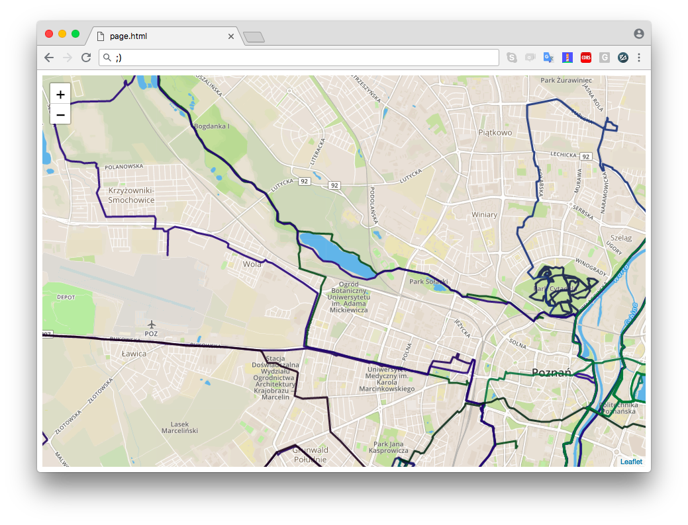

# Plotted
CLI tool that plots your Strava activities on a map.


## Why?
I wanted to have a tool that will plot all my routes from given period on a single map.

## Prerequisities
1. Account on https://www.strava.com account with something to plot, and application created on the https://www.strava.com/settings/api. 
2. Account on https://www.mapbox.com
3. Get access tokens from abovementioned websites.

## Getting started
1. Clone this repository
2. Build application
```
go build
```
3. Check supported options with
```
./plotted --help
```
4. Run with some parameters;
./plotted -start=01/06/2018 -end=30/06/2018 -extended  -strava=YOUR_STRAVA_ACCESS_TOKEN -mapbox=YOUR_MAPBOX_TOKEN
